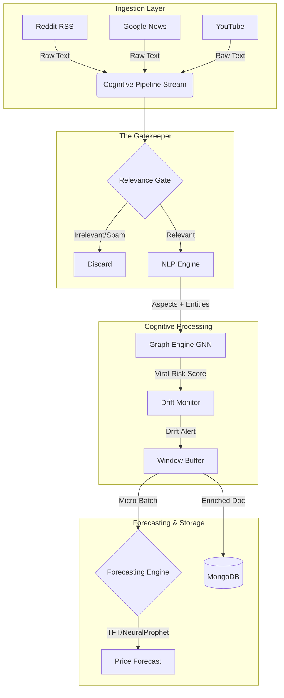

# Agri-Trend: Real-Time Cognitive Agricultural Intelligence

Agri-Trend is an advanced "System of Insight" for agricultural markets. It evolves beyond heuristic baselines to a **Real-Time Cognitive Architecture** capable of forecasting price trends, detecting viral risks, and filtering non-agricultural noise from social media streams.

## 🧠 Cognitive Architecture

This system uses a **Kappa Architecture** pattern to process streaming data through a series of intelligent engines.



## 🚀 Key Modules

### 1. The Gatekeeper (`scripts/advanced_analytics/relevance_gate.py`)
**Solves the "Karma Farm" Problem.**
- Uses a hybrid filter (Blacklist + Contextual Intersection) to block gaming terms ("server farm", "farming xp") and ensure only legitimate agricultural data enters the pipeline.

### 2. NLP Engine (`scripts/advanced_analytics/nlp_engine.py`)
**Domain-Adaptive Understanding.**
- **AgriBERT Integration**: Understands agricultural nuances (e.g., "blight" = disease).
- **Aspect-Based Sentiment Analysis (ABSA)**: Decouples sentiment into **Yield**, **Price**, and **Policy**.

### 3. Graph Neural Network (`scripts/advanced_analytics/graph_engine.py`)
**Risk & Influence Modeling.**
- Models the relationship between **Influencers**, **Commodities**, and **Mandis**.
- Predicts **Viral Risk** (e.g., panic selling driven by influential users) before it impacts price.

### 4. Forecasting Engine (`scripts/advanced_analytics/forecasting_engine.py`)
**State-of-the-Art Prediction.**
- Uses **Temporal Fusion Transformers (TFT)** and **NeuralProphet**.
- Generates multi-horizon price forecasts (T+3 Days) by combining social sentiment, weather data, and known future events (holidays).

## 🛠️ Usage

### 1. Prerequisites
- Python 3.9+
- MongoDB (Local or Atlas)
- Node.js 18+

### 2. Run the Cognitive Pipeline
Start the Python backend to stream data, analyze it, and store insights.
```bash
python scripts/cognitive_pipeline.py
```

### 3. Run the Dashboard
Start the Next.js frontend to visualize the data.
```bash
npm run dev
```
Open [http://localhost:3000](http://localhost:3000) to view the Real-Time Dashboard.

## 📂 Project Structure
- `scripts/cognitive_pipeline.py`: The Main Orchestrator (Kappa Stream).
- `scripts/social_media_pipeline.py`: Data Scrapers (Reddit, News, YouTube).
- `scripts/advanced_analytics/`: The Brain (NLP, GNN, Drift, Gate).
- `src/`: Next.js Frontend.
